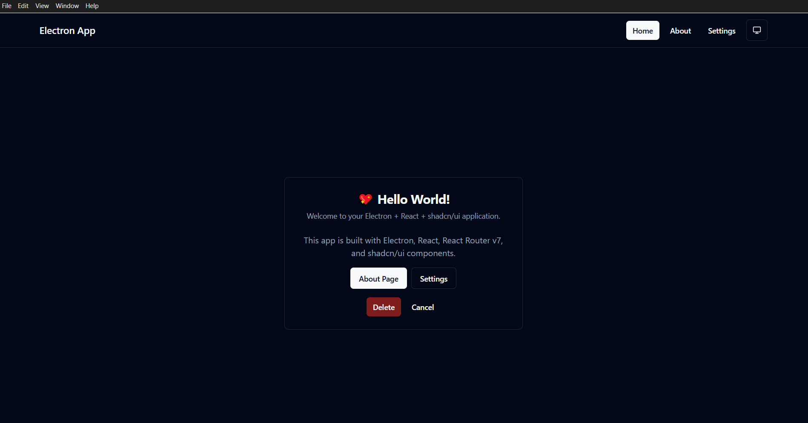

# Electron + shadcn/ui Template

A modern Electron application template built with React, TypeScript, Vite, and shadcn/ui components. This template provides a solid foundation for building beautiful desktop applications with a complete UI component system and theme support.

## 📸 Screenshot



*Modern Electron application with shadcn/ui components, featuring theme toggle and responsive design*

## ✨ Features

- **⚡ Electron 39.0** - Cross-platform desktop app framework
- **⚛️ React 19.2** - Modern React with latest features
- **🔷 TypeScript 5.3** - Type-safe development
- **⚡ Vite 5.4** - Fast build tool and dev server
- **🎨 shadcn/ui** - Beautiful, accessible UI components built on Radix UI
- **🎭 Tailwind CSS 3.4** - Utility-first CSS framework
- **🌙 Theme Support** - Light, dark, and system theme modes with persistence
- **🧭 React Router v7.9** - Client-side routing with modern patterns
- **📱 Responsive Design** - Mobile-first approach with Tailwind breakpoints
- **🔧 Electron Forge 7.10** - Complete build and packaging toolchain
- **📦 Modern Tooling** - ESLint 8.57, PostCSS 8.5, Autoprefixer 10.4
- **🎯 Developer Experience** - Hot reload, TypeScript path mapping, and comprehensive linting

## 🚀 Quick Start

### Prerequisites

- Node.js (v18 or higher)
- npm or yarn

### Installation

1. **Clone this template**
   ```bash
   git clone https://github.com/rohitsoni007/electron-shadcn.git my-electron-app
   cd my-electron-app
   ```

2. **Install dependencies**
   ```bash
   npm install
   ```

3. **Start development**
   ```bash
   npm start
   ```

## 📦 Available Scripts

- `npm start` - Start the Electron app in development mode
- `npm run package` - Package the app for distribution
- `npm run make` - Create distributable packages
- `npm run publish` - Publish the app
- `npm run lint` - Run ESLint

## 🏗️ Project Structure

```
src/
├── components/          # React components
│   ├── ui/             # shadcn/ui components
│   ├── Layout.tsx      # Main layout component
│   ├── ThemeProvider.tsx # Theme context provider
│   └── ThemeToggle.tsx # Theme toggle button
├── hooks/              # Custom React hooks
├── lib/                # Utility functions
├── pages/              # Page components
│   ├── Home.tsx
│   ├── About.tsx
│   └── Settings.tsx
├── App.tsx             # Main App component
├── main.ts             # Electron main process
├── router.tsx          # React Router configuration
└── index.css           # Global styles
```

## 🎨 UI Components

This template includes a complete set of shadcn/ui components:

- **Layout**: Button, Card, Dialog, Sheet, Tabs
- **Forms**: Input, Label, Select, Checkbox, Radio Group
- **Navigation**: Navigation Menu, Breadcrumb, Pagination
- **Feedback**: Alert, Toast, Progress, Skeleton
- **Data Display**: Table, Avatar, Badge, Separator
- **Overlay**: Popover, Tooltip, Hover Card, Context Menu

## 🌙 Theme System

The template includes a complete theme system with:

- **Light Mode** - Clean, bright interface
- **Dark Mode** - Easy on the eyes
- **System Mode** - Follows OS preference
- **Theme Toggle** - Easy switching between modes
- **Persistent Settings** - Theme preference saved to localStorage

### Using Themes

```tsx
import { useTheme } from "@/components/ThemeProvider";

function MyComponent() {
  const { theme, setTheme } = useTheme();
  
  return (
    <button onClick={() => setTheme("dark")}>
      Switch to Dark Mode
    </button>
  );
}
```

## 🧭 Routing

The template uses React Router v7 for navigation:

```tsx
// Add new routes in src/router.tsx
{
  path: "/my-page",
  element: <MyPage />,
}
```

## 🎯 Adding New Components

### Using shadcn/ui CLI

```bash
npx shadcn@latest add [component-name]
```

### Manual Component Creation

1. Create component in `src/components/`
2. Use TypeScript and follow the existing patterns
3. Import and use in your pages

## 🔧 Configuration

### Tailwind CSS

Customize your design system in `tailwind.config.js`:

```js
module.exports = {
  theme: {
    extend: {
      colors: {
        // Add your custom colors
      }
    }
  }
}
```

### Vite Configuration

Modify build settings in `vite.renderer.config.ts`:

```ts
export default defineConfig({
  // Your custom Vite config
});
```

## 📱 Building for Production

### Local Build

#### Package the App

```bash
npm run package
```

#### Create Distributables

```bash
npm run make
```

This will create platform-specific distributables in the `out/` directory.

### Automated Builds (GitHub Actions)

This template includes GitHub Actions workflows for automated building and releasing:

#### Build Workflow
- **Triggers**: Push to main, pull requests, and tags
- **Platforms**: Windows, macOS, and Linux
- **Outputs**: Executable files for all platforms
- **Artifacts**: Automatically uploaded and stored for 30 days

#### Release Workflow
- **Triggers**: Git tags starting with `v` (e.g., `v1.0.0`)
- **Features**: 
  - Cross-platform builds
  - Code signing support (macOS and Windows)
  - Automatic GitHub releases
  - Release notes generation

#### Creating a Release

1. **Tag your release**:
   ```bash
   git tag v1.0.0
   git push origin v1.0.0
   ```

2. **GitHub Actions will automatically**:
   - Build for all platforms
   - Create distributable packages
   - Create a GitHub release
   - Upload all build artifacts

#### Code Signing Setup (Optional)

For production releases, you can set up code signing by adding these secrets to your GitHub repository:

**macOS Code Signing:**
- `APPLE_CERTIFICATE` - Base64 encoded .p12 certificate
- `APPLE_CERTIFICATE_PASSWORD` - Certificate password
- `APPLE_ID` - Apple ID for notarization
- `APPLE_APP_SPECIFIC_PASSWORD` - App-specific password
- `APPLE_TEAM_ID` - Apple Developer Team ID
- `KEYCHAIN_PASSWORD` - Keychain password

**Windows Code Signing:**
- `WINDOWS_CERTIFICATE` - Base64 encoded certificate
- `WINDOWS_CERTIFICATE_PASSWORD` - Certificate password

## 🛠️ Development Tips

1. **Hot Reload** - The development server supports hot reload for fast iteration
2. **TypeScript** - Use TypeScript for better development experience
3. **Component Library** - Leverage the included shadcn/ui components
4. **Theme Consistency** - Use CSS variables for consistent theming
5. **Path Aliases** - Use `@/` imports for cleaner code organization

## 📚 Learn More

- [Electron Documentation](https://www.electronjs.org/docs)
- [React Documentation](https://react.dev)
- [shadcn/ui Documentation](https://ui.shadcn.com)
- [Tailwind CSS Documentation](https://tailwindcss.com/docs)
- [Vite Documentation](https://vitejs.dev)

## 🤝 Contributing

1. Fork the repository
2. Create your feature branch (`git checkout -b feature/amazing-feature`)
3. Commit your changes (`git commit -m 'Add some amazing feature'`)
4. Push to the branch (`git push origin feature/amazing-feature`)
5. Open a Pull Request

## 📄 License

This project is licensed under the MIT License - see the [LICENSE](LICENSE) file for details.

---

**Happy coding! 🚀**

Built with ❤️ using Electron + shadcn/ui